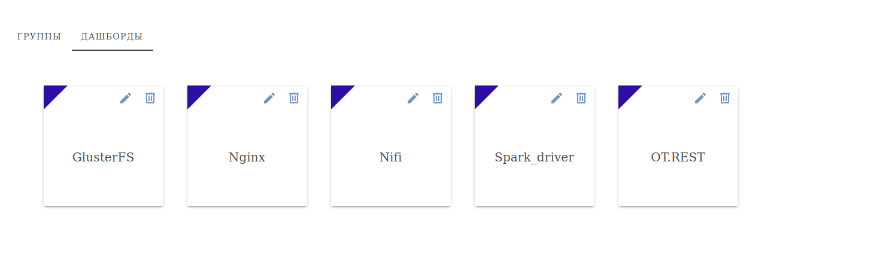

# Средства для монтиринга

Пакет включает в себя темплейт для загрузки логов в найфай и дашборды для визуализации метрик по данным, полученных из логов.
Для сбора логов дополнительно можно использовать rsyslog, данные будут поступать в nifi на настроенный TCP порт.

## Настройка

Для работы с EVA необходимо восстановить дашборды в базу данных - для этого необходимо содержимое файла self_monitoring/eva/dashboards.sql вставить в БД eva 
(это можно сделать командой: `psql -h localhost -U dispatcher eva < eva/dashboards.sql`). На экране должна появиться группа Logs и связанные с ней дашборды:

В каждом из них источники данных и панели с полученными данными. Для запуска запросов должен быть доступ к запрашиваемым индексам.

Для настройки темплейта Nifi, необходимо скопировать flow.xml.gz из директории self_monitoring/nifi в папку config в Nifi. После запуска Nifi, необходимо запустить темплейт.
Темплейт логов состоит из двух частей: сбора логов с компонентов (сбор по TCP по умолчанию выключен) и процесса обработки с сохранением в индекс:

На данный момент, логи собираются из следующих директорий:

        gluster: /var/log/glusterfs 
        nginx: /var/log/nginx
        nifi: /opt/otp/logs/nifi
        ot_rest: /opt/otp/logs/ot_simple_rest
        spark_event_log: /opt/otp/logs/spark-eventlog
        spark_executors: /opt/otp/tmp

Для Spark-a из директории /opt/otp/tmp берутся файлы с названием `app-\d{14}-\d{4}` и `driver-\d{14}-\d{4}`,соответсвующие запущенному приложению.
Директории и пременные находятся в настройках Nifi (Parameter context) и могут быть изменены в этом меню.
### Процесс сборки 
 
В этом шаблоне находятся разные наборы для сбора с компонентов. 
Процессор для чтения логов (TailFile) считывает новые строчки из лога. Путь к логу указан через переменные контекста.
К логу добавляются атрибуты - его название, с какого хоста и в какой индекс потом он попадет:
  

Для визуализации в EVA необходимо либо экспортировать группу дашбордов, либо восстановить прилагаемый дамп (dashboard.sql).

Для работы с rsyslog необходимо создать нужные конфиги ([например](../monitoring_tools/rsyslog/rsyslog.d/spark.conf.example)), обновляя тэг и путь для нужного лога.

### Процесс обработки
  
Этот темплейт (вместе с входным портом) находится на главном сервере Nifi. Как только minifi присылает логи, они проходят через процессор, который направит лог в обработку по соотвествующему названию.
  

  
Например, логи спарка будут обработаны следующими процессорами:
  
Каждая строчка лога будет обработана парсером, пришедший файл будет иметь структуру json. Лишние поля, которые не понадобятся в дальнейшем для анализа могут быть удалены. 
  

  
После предварительной обработки, к логам добавляется еще несколько атрибутов и после они отправляются на запись в индекс.
  

  
В последеней фазе обработки к логам добавляются атрибуты для бакетов (начало и конец временного отрезка и время финализации),название бакета. Данные записываются в формате parquet в определенный логом индекс.
  

### Работа с rsyslog

Для сбора логов с rsyslog необходимо создать конфиги для каждого файла (пример конфига находится в папке rsyslog.d) и запустить rsyslog с помощью start.sh.

