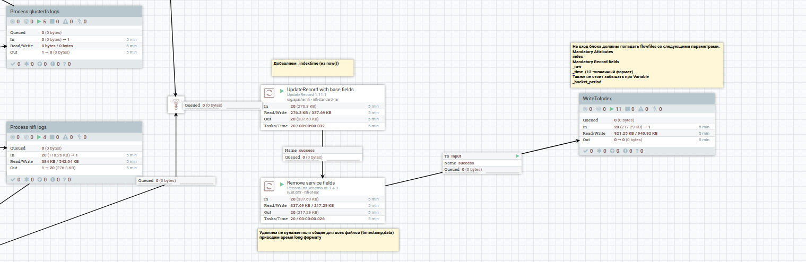

# Средства для монтиринга

Пакет включает в себя темплейт для загрузки логов в найфай и дашборды для визуализации метрик по данным, полученных из логов.
Для сбора логов дополнительно можно использовать rsyslog, данные будут поступать в nifi на настроенный TCP порт.

## Настройка

Для настройки темплейта, необходимо скопировать flow.xml.gz в папку config в Nifi. После запуска Nifi, необходимо запустить темплейт. 
Темплейт логов состоит из двух частей: сбора логов с компонентов (сбор по TCP по умолчанию выключен) и процесса обработки с сохранением в индекс:

### Процесс сборки 
 
В этом шаблоне находятся разные наборы для сбора с компонентов. 
Процессор для чтения логов (TailFile) считывает новые строчки из лога. Путь к логу указан через переменные контекста.
К логу добавляются атрибуты - его название, с какого хоста и в какой индекс потом он попадет:
  

Для визуализации в EVA необходимо либо экспортировать группу дашбордов, либо восстановить прилагаемый дамп (dashboard.sql).

Для работы с rsyslog необходимо создать нужные конфиги ([например](../monitoring_tools/rsyslog/rsyslog.d/spark.conf.example)), обновляя тэг и путь для нужного лога.

### Процесс обработки
  
Этот темплейт (вместе с входным портом) находится на главном сервере Nifi. Как только minifi присылает логи, они проходят через процессор, который направит лог в обработку по соотвествующему названию.
  

  
Например, логи спарка будут обработаны следующими процессорами:
  
Каждая строчка лога будет обработана парсером, пришедший файл будет иметь структуру json. Лишние поля, которые не понадобятся в дальнейшем для анализа могут быть удалены. 
  

  
После предварительной обработки, к логам добавляется еще несколько атрибутов и после они отправляются на запись в индекс.
  

  
В последеней фазе обработки к логам добавляются атрибуты для бакетов (начало и конец временного отрезка и время финализации),название бакета. Данные записываются в формате parquet в определенный логом индекс.
  
  

